<h1 align="center">JobScout-Lite</h1>
<h3 align="center">Data & Control Flow Diagrams</h3>

The following charts outline the strict sequences in which data payloads move across the system boundaries without external dependency.

---

## 

This process occurs asynchronously anytime a message is sent over Telegram.

```mermaid
sequenceDiagram
    autonumber
    participant User as Remote User (Telegram)
    participant Tele as Telegram Servers
    participant Python as bot.py (Long Polling)
    participant Ollama as Ollama API
    participant GPU as Local GPU (Chat Model)

    User->>Tele: text: "Summarize this paper"
    Tele->>Python: Poll Update / Message Received
    
    rect rgb(20, 20, 30)
    Note over Python,GPU: Inference Pipeline
    Python->>Python: Load SOUL.md (Persona)
    Python->>Python: Prepend historical chat logs (up to 20)
    Python->>Ollama: POST /api/chat {model: fast, messages}
    Ollama->>GPU: Load layers to VRAM
    GPU-->>Ollama: Inference Tokens
    end
    
    Ollama-->>Python: JSON Response (Message content)
    Python->>Tele: send_message(reply)
    Tele->>User: Delivery
```



---

## 

This process happens purely automatically based on the OS Scheduler / Startup trigger.

```mermaid
sequenceDiagram
    autonumber
    participant OS as OS Task Scheduler / Startup
    participant JobFinder as job_finder.py
    participant Web as Internet Portals (LinkedIn, Naukri, Glassdoor...)
    participant Cache as seen_jobs.json (core/cache.py)
    participant Scorer as Scorer Pipeline (core/scorer.py)
    participant Ollama as Ollama API
    participant GPU as Local GPU (Scoring Model)
    participant Tele as Telegram API

    OS->>JobFinder: Execute script
    
    rect rgb(10, 30, 20)
    Note over JobFinder,Web: Step 1: Web Data Collection
    JobFinder->>Web: Parallel searches (LinkedIn, Naukri, Glassdoor...)
    Web-->>JobFinder: Raw HTML / JSON Payload (500+ jobs)
    end
    
    JobFinder->>Cache: Filter seen jobs (Company + Title hash)
    Cache-->>JobFinder: Return novel jobs
    
    rect rgb(30, 30, 20)
    Note over JobFinder,Scorer: Step 2: Keyword Pre-Filter
    JobFinder->>Scorer: Run keyword_prefilter() vs profile keywords
    Scorer-->>JobFinder: Filtered candidate jobs (High Recall)
    end
    
    rect rgb(40, 20, 20)
    Note over JobFinder,GPU: Step 3: LLM Match Classification
    loop For Every Candidate Job
        JobFinder->>Scorer: score_job_llm()
        Scorer->>Ollama: POST /api/chat {model: 4b, format: json, profile, job}
        Ollama->>GPU: Inference
        GPU-->>Ollama: Return structured JSON tokens
        Ollama-->>Scorer: {"match": "STRONG_MATCH/GOOD_MATCH/NO_MATCH", "reason": "..."}
        Scorer-->>JobFinder: Classify & save match details
    end
    end
    
    rect rgb(20, 20, 40)
    Note over JobFinder,Tele: Step 4: Dispatch Matches
    JobFinder->>Tele: Send "Collection Complete" & summary statistics
    JobFinder->>Tele: Send ranked job detail cards (Strong & Good matches)
    end

---

## 

```mermaid
pie title Example VRAM Allocation (8GB GPU)
    "OS / System Buffer" : 2
    "Chat Model (e.g. qwen3:fast)" : 2.4
    "Scoring Model (e.g. qwen3:4b)" : 3.5
```
*(If both models are kept in memory correctly via careful context window clipping, zero spillover occurs, preserving maximum Tokens/Sec).*
